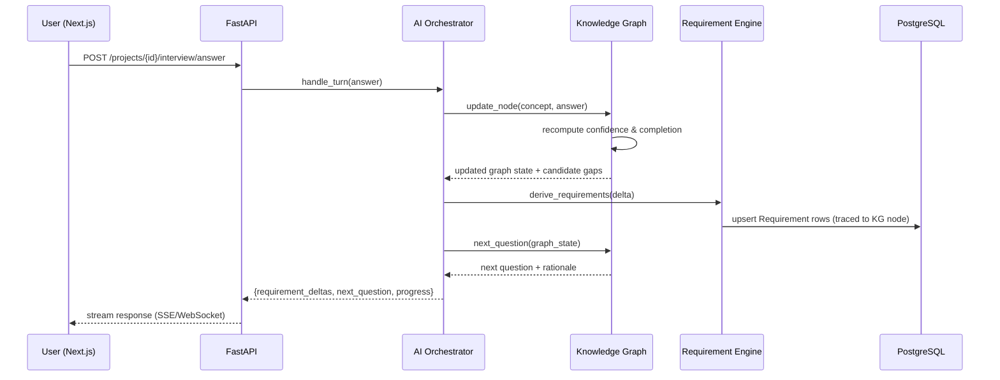
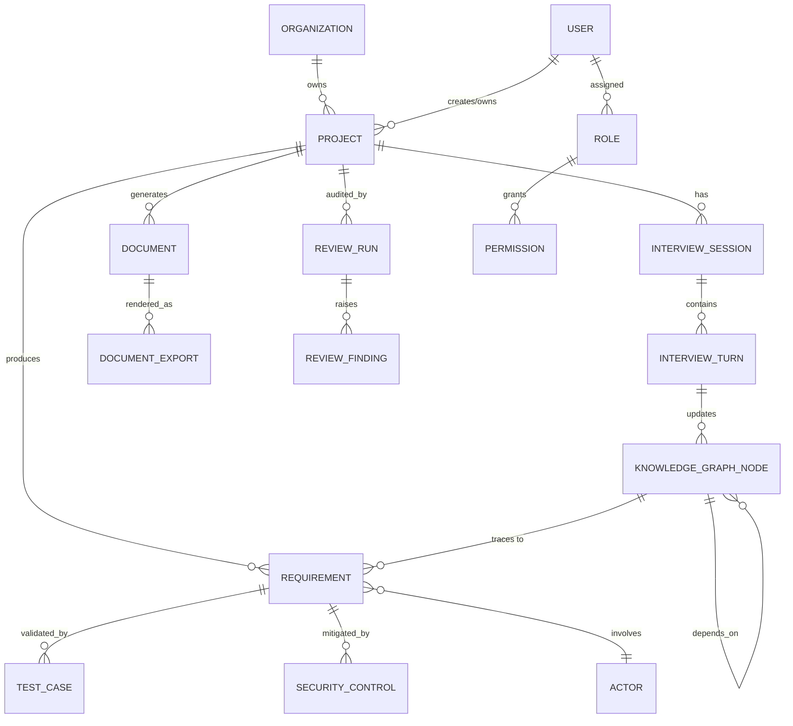

# Secure Requirements Studio — Architecture Report & Roadmap

**Prepared for:** Fondation OCP — Plateforme de Gestion des Bénéficiaires (Al Moutmir)
**Scope:** Evolve the existing Next.js mockup into an AI-driven requirements engineering platform

---

## 1. Current State Analysis

### 1.1 What exists today

The uploaded project (`secure-requirements-studio`) is a **frontend-only prototype**. Its own README says so explicitly: no auth, no API, no database — everything renders from a single static file, `src/lib/mock-data.ts` (589 lines).

| Layer | Current state |
|---|---|
| Framework | Next.js 15 (App Router), TypeScript, React 19 |
| Styling | Tailwind CSS v4, Framer Motion, hand-built shadcn-style primitives (no Radix runtime) |
| Pages | 7 routes: landing, dashboard, wizard (`/projects/new`), summary, document, admin, admin project detail |
| API routes | **None** |
| Database | **None** |
| Auth | **None** |
| State management | Local React state only, no persistence, no store |
| Forms | One multi-step wizard, driven by a **hardcoded** `WizardStep[]` array with a static `followUps` tree — not adaptive, not backed by any reasoning engine |
| Document generation | None — `/document` renders static `DocumentSection[]` mock objects; no PDF/DOCX export exists |
| AI integration | **None** |
| Exports | **None** |
| Components | A genuinely solid, reusable UI kit — 19 `ui/` primitives, wizard components, document TOC/section/requirement-block, admin charts, layout shells |

### 1.2 Reuse / Improve / Replace

**Reuse as-is:**
- Entire `src/components/ui/` primitive library
- Page shells and layout components (Sidebar, TopNav, AdminSidebar, MobileDrawer)
- Document rendering components (`Toc`, `DocumentSection`, `RequirementBlock`) — they already expect a shape close to what a real requirement engine would emit
- Wizard UI components (`Stepper`, `QuestionCard`, `TagInput`, `UploadZone`) — the rendering shell is fine, only its data source needs to change
- Design tokens / Tailwind theme, fonts, dark mode setup

**Improve:**
- `types.ts` — extend rather than replace; e.g. `DocumentRequirement` maps closely onto the real `Requirement` entity but is missing traceability fields (owner, test cases, dependencies, risk)
- Wizard question rendering — keep the component, but it must render questions **fetched per-turn from the Interview Engine**, not a precomputed flattened list

**Replace entirely:**
- `mock-data.ts` → real API layer (typed client against FastAPI, e.g. via `fetch`/`openapi-typescript` codegen)
- Static wizard question tree → Knowledge-Graph-driven Interview Engine
- No-op `/document` → real Document Generator output with export pipeline
- No auth → real session-based auth against the backend

---

## 2. Target System Architecture

```
┌─────────────────────────────────────────────────────────────────────┐
│  Next.js 15 (App Router)                                             │
│  Pages, Server Actions, streaming UI, WebSocket client                │
└──────────────────────────────┬────────────────────────────────────────┘
                                │ HTTPS / REST + WebSocket
┌──────────────────────────────▼────────────────────────────────────────┐
│  FastAPI (Python 3.12)                                               │
│  Routers → Services → Repositories · Pydantic schemas · Auth deps     │
└──────────────────────────────┬────────────────────────────────────────┘
                                │
┌──────────────────────────────▼────────────────────────────────────────┐
│  AI Orchestrator                                                     │
│  Routes turns to the right engine; manages LLM calls, retries, cost   │
└───────┬───────────────┬──────────────┬───────────────┬────────────────┘
        │               │              │               │
┌───────▼──────┐ ┌──────▼───────┐ ┌────▼─────────┐ ┌───▼────────────┐
│ Knowledge     │ │ Requirement  │ │ Security     │ │ Document        │
│ Graph         │ │ Engine       │ │ Engine       │ │ Generator        │
│ (concepts,    │ │ (BRD/FRD/    │ │ (STRIDE,     │ │ (SRS/BRD/CdC,    │
│ deps, conf.)  │ │ NFR, trace)  │ │ OWASP, RBAC) │ │ exports)         │
└───────┬───────┘ └──────┬───────┘ └────┬─────────┘ └───┬────────────┘
        │               │              │               │
        └───────────────┴──────┬───────┴───────────────┘
                                │
                        ┌───────▼────────┐
                        │ Review Engine   │
                        │ (100+ rules,    │
                        │  scoring, gate) │
                        └───────┬────────┘
                                │
        ┌───────────────┬──────┴──────┬───────────────┬──────────────┐
┌───────▼──────┐ ┌───────▼──────┐ ┌───▼─────────┐ ┌────▼────────┐ ┌──▼──────────┐
│ PostgreSQL    │ │ Redis        │ │ Vector DB   │ │ Object       │ │ Auth         │
│ (system of    │ │ (cache,      │ │ (pgvector — │ │ Storage      │ │ (JWT +       │
│ record)       │ │ Celery       │ │ embeddings, │ │ (S3-compat., │ │ refresh,     │
│               │ │ broker)      │ │ RAG memory) │ │ exports/docs)│ │ RBAC)        │
└───────────────┘ └──────────────┘ └─────────────┘ └──────────────┘ └─────────────┘
                                │
                        ┌───────▼────────┐
                        │ Monitoring      │
                        │ (structured     │
                        │ logs, /metrics, │
                        │ /health, traces)│
                        └────────────────┘
```

**Design notes**
- **Vector DB = pgvector inside PostgreSQL**, not a separate service. It halves your ops surface (one DB to back up, one connection pool) and is sufficient at this data volume (single organization, hundreds of projects, not billions of embeddings). Swap for a dedicated vector store only if RAG corpus size or query latency later demands it.
- **AI Orchestrator** is a thin coordination layer, not a monolith — it decides *which* engine handles a given turn and shapes the LLM prompt/response contract; the engines hold the actual domain logic so they're independently testable without an LLM in the loop.
- **Celery + Redis** handle anything slow or bursty: document generation, embedding backfills, review-rule sweeps, export rendering (PDF/DOCX) — kept off the request/response path so the UI can poll or subscribe via WebSocket instead of blocking.

### 2.1 Sequence — one interview turn



### 2.2 ER Diagram (core entities)



### 2.3 API Architecture (representative surface)

```
/auth            POST /login  POST /refresh  POST /logout  GET /me
/projects        GET/POST /            GET/PATCH/DELETE /{id}
/interview       POST /{project_id}/start
                  POST /{project_id}/answer        (drives KG + returns next question)
                  GET  /{project_id}/state          (resume)
                  WS   /{project_id}/stream          (live turn streaming)
/knowledge-graph GET /{project_id}/graph            GET /{project_id}/gaps
/requirements    GET/POST /{project_id}              GET/PATCH /{project_id}/{req_id}
                  GET /{project_id}/traceability-matrix
/security        POST /{project_id}/analyze          GET /{project_id}/threat-model
                  GET /{project_id}/rbac-matrix        GET /{project_id}/risk-register
/documents       POST /{project_id}/generate          GET /{project_id}/preview (SSE)
/exports         POST /{project_id}/export?format=pdf|docx|md|html|json
                  GET  /exports/{export_id}/download
/review          POST /{project_id}/run               GET /{project_id}/score
/health          GET /health   GET /health/ready
/metrics         GET /metrics (Prometheus format)
```

---

## 3. Backend build plan (FastAPI)

Poetry-managed Python 3.12 project, layered `router → service → repository`, Pydantic v2 schemas separate from SQLAlchemy models, Alembic migrations, dependency-injected DB sessions and current-user, structured JSON logging, `/health` + `/health/ready` + `/metrics`, Celery workers for generation/export/review jobs, pytest with a real test DB (testcontainers or a docker-compose test service) — no mocked-out "always green" tests.

---

## 4. Implementation Roadmap

| Phase | Deliverable | Depends on |
|---|---|---|
| **0** | Repo scaffolding: FastAPI skeleton, Docker Compose (Postgres, Redis), Alembic, config, logging, health checks, CI running real tests | — |
| **1** | Auth + Users + Orgs + RBAC; Projects CRUD; connect Next.js to real API (kill `mock-data.ts`) | 0 |
| **2** | Knowledge Graph schema + traversal service (no AI yet — deterministic graph, seeded with the OCP domain concepts) | 1 |
| **3** | Interview Engine: LLM-backed turn handler (understand/infer/validate/update KG/next-question), autosave, resume, streaming to frontend | 2 |
| **4** | Requirement Engine: derive typed, traceable requirements from KG state; traceability matrix endpoint | 2, 3 |
| **5** | Security Engine: STRIDE/DREAD modeling, RBAC matrix, gap detection, mitigation generation | 4 |
| **6** | Document Generator: SRS/BRD/CdC assembly + Mermaid/PlantUML diagram emission + PDF/DOCX/MD/HTML/JSON export via Celery | 4, 5 |
| **7** | Review Engine: rule pack, scoring, 95% export gate | 4, 5, 6 |
| **8** | Frontend integration hardening: WebSockets, live preview, dashboard/admin wired to real data, remove all placeholders | 1–7 |
| **9** | Full integration test pass, monitoring/metrics, backups, deployment docs, final checklist | 0–8 |

Each phase should ship independently runnable and tested — not partial stubs — so the app is always in a working state end to end, just with a growing feature set.

---

## 5. Recommended immediate next step

Start Phase 0 + Phase 1: a real FastAPI backend (auth, Postgres, Docker Compose, tested, healthchecked) wired to the existing Next.js frontend in place of `mock-data.ts`. That gives you a genuinely working full-stack app to build every later phase on top of, instead of a bigger and bigger mock.
